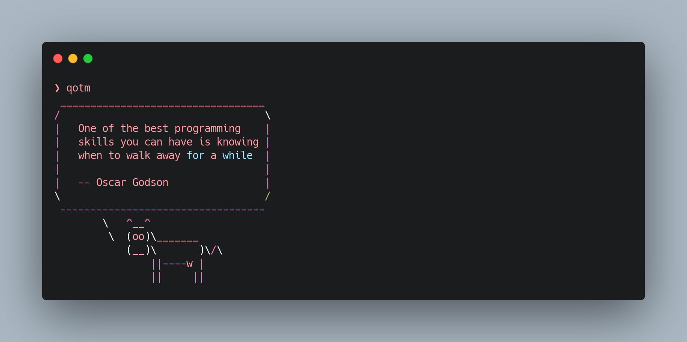

# Quote of the Moment
Display a random tech or programming quote to the console.

## Overview
`qotm` is my version of `fortune` but outputs tech or programming quotes.


## Installation
```sh
# Installing qotm
> npm install -g qotm
```
### Usage
```sh
qotm
 _________________________________
/                                 \
|   Write shy code - modules that |
|   don't reveal anything         |
|   unnecessary to other modules  |
|   and that don't rely on other  |
|   modules' implementations      |
|                                 |
|   -- Unknown                    |
\                                 /
 ---------------------------------
        \   ^__^
         \  (oo)\_______
            (__)\       )\/\
                ||----w |
                ||     ||
```
You can also add the command to your shell's `*rc` file (.bashrc, .zshrc, etc. or whatever file the shell loads on startup) so it outputs a quote every time you open a new shell.

### Updates
This Repo will be frequently updated with new quotes. Simply run `npm i -g qotm` to get the latest updates. Expect an update notifier to be added in future updates so as to prompt you when new updates are ready.

## Contributing
There are thousands of tech and programming quotes out there. You have your favorites right? Add them to the `contributing.json` file using the specified format and submit a pull request to the `qotm-cli` branch. I'll be happy to pull them in and make them available in subsequent updates. You can also help in any other way you can, be it code refactoring, typo fixes, etc. <br>
*NB*: I may need to verify the quote and it's author. Please do check as well before adding quotes. 

```sh
❯ qotm
 __________________________________
/                                  \
|   One of the best programming    |
|   skills you can have is knowing |
|   when to walk away for a while  |
|                                  |
|   -- Oscar Godson                |
\                                  /
 ----------------------------------
        \   ^__^
         \  (oo)\_______
            (__)\       )\/\
                ||----w |
                ||     ||
```
