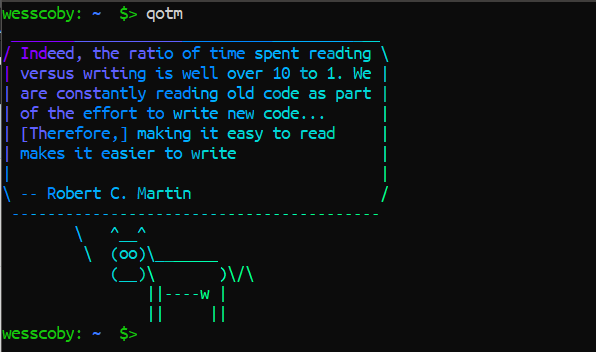

## Quote of the Moment
If you've ever used the `fortune` package, this is quite similar. Most of use us it with `cowsay` and/or `lolcat`.<br>
If not, then: <br>
-   **fortune:** basically, a program that displays quotes or random messages. To install: 
    -   `sudo apt-get install fortune`  
-   **cowsay:** To install:
    -   `sudo apt-get install cowsay`
-   **lolcat:** formats text with nice colors. To install:
    -   `sudo apt-get install lolcat`

### Overview

`qotm` is my version of `fortune` but outputs programming quotes (well, plus a few quotes i have created :wink:) and it makes use of both `lolcat` and `cowsay`. So it is best to have them installed first. And, oh! this is a bash script which runs a Javascript file in the background to fetch the quote from a JSON file, then output.



### Installation
Clone the project into a `.bash` folder in your home directory:
```sh
mkdir ~/.bash
cd ~/.bash 
git clone git@github.com:WessCoby/qotm.git
cd qotm
```
Then run the `install.sh` file:
```sh
./install.sh
```
Make sure you are in the root directory `qotm`. If you get a 'Permission Denied' error, change the file attribute to make it executable:
```sh
chmod u+x install.sh
```
Reload bash: `source ~/.bashrc` or `exit` and  the reopen the terminal.
That's it. Simply run `qotm` to display a random quote.

### Updates
This Repo will be constantly updated with new quotes. Simply run `qotm-u` to pull in new updates.